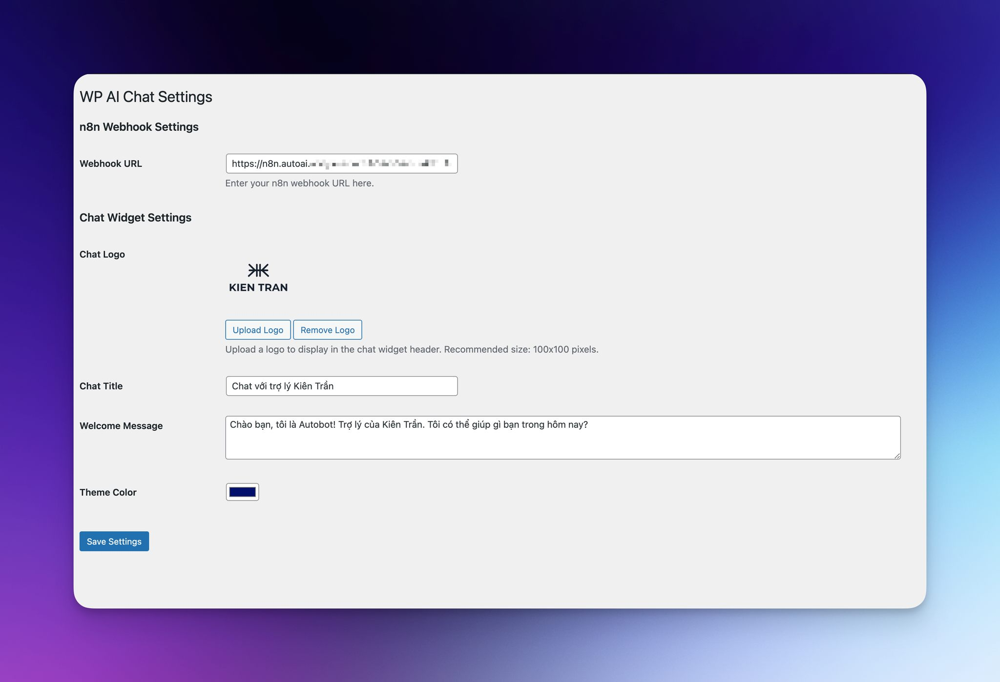

# WP AI Chat

A modern AI Chatbot for WordPress with n8n webhook integration. This plugin provides a clean, user-friendly interface for your website visitors to interact with your AI chatbot.



## Features

- 🎨 Modern and professional chat interface
- 🔌 n8n webhook integration
- ⚙️ Customizable chat title and welcome message
- 🎯 Theme color customization
- 🖼️ Logo support
- 📱 Mobile responsive design
- ⌨️ Typing indicators
- ✨ Smooth animations

## Requirements

- WordPress 5.0 or higher
- PHP 7.2 or higher
- n8n instance with webhook workflow

## Installation

1. Upload the `wp-aichat` folder to the `/wp-content/plugins/` directory
2. Activate the plugin through the 'Plugins' menu in WordPress
3. Go to 'AI Chat' in the WordPress admin menu
4. Configure your n8n webhook URL and other settings

## Configuration

### n8n Webhook Setup

1. Create a new workflow in n8n
2. Add a "Webhook" node
3. Configure it to receive POST requests
4. Add a "Function" node with this code:
```javascript
return {
  message: "Your response message here"
};
```
5. Add a "Respond to Webhook" node
6. Connect the nodes and activate the workflow
7. Copy the webhook URL to the plugin settings

### Chat Widget Customization

You can customize:
- Chat title
- Welcome message
- Theme color
- Logo

## Screenshots

1. Chat widget on website
2. Admin settings page
3. Mobile view

## Contributing

Contributions are welcome! Please feel free to submit a Pull Request.

## License

This project is licensed under the GPLv2 or later - see the [LICENSE](LICENSE) file for details.

## Credits

- Developed by [Kien Ventures](https://www.kien.vc)
- Built with ❤️ for the WordPress community

## Support

For support, please [open an issue](https://github.com/yourusername/wp-aichat/issues) on GitHub.

## Changelog

### 1.0.0
- Initial release 